# Object Detection in an Urban Environment

## Data

For this project, we will be using data from the [Waymo Open dataset](https://waymo.com/open/).


## Structure


### Data

The data we will use for training, validation and testing is organized as follow:
```
/home/workspace/data/
    - train: contain the train data (empty to start)
    - val: contain the val data (empty to start)
    - test - contains 3 files to test your model and create inference videos
```


### Download and process the data
I used the Udacity Workspace, they already had the data processed ready to use.

## Dataset


### Exploring dataset


| 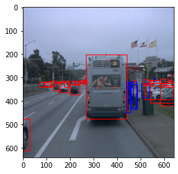  |  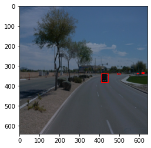 |
:-------------------------:|:-------------------------:
| 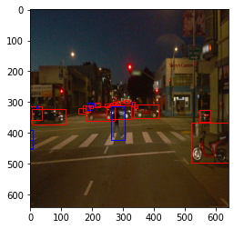  |  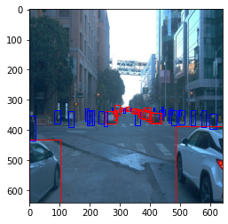 |
| 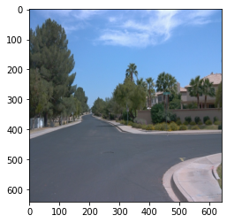  |  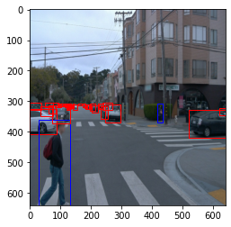 |


### Create the training - validation splits

Already done


### Analysis


I used random 2k samples from the dataset to analyse.

1. Dataset is skewed in terms of number of samples available for each class. Class 1 (cars) has maximum samples. Class 4 (cyclists) is very rare in the dataset.

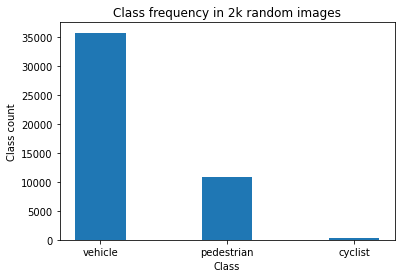


### The config file

The config is `pipeline.config`, which is the config for a SSD Resnet 50 640x640 model. 

We need to edit the config files to change the location of the training and validation files, as well as the location of the label_map file, pretrained weights. We also need to adjust the batch size. To do so, run the following:
```
python edit_config.py --train_dir /home/workspace/data/train/ --eval_dir /home/workspace/data/val/ --batch_size 2 --checkpoint /home/workspace/experiments/pretrained_model/ssd_resnet50_v1_fpn_640x640_coco17_tpu-8/checkpoint/ckpt-0 --label_map /home/workspace/experiments/label_map.pbtxt
```
A new config file has been created, `pipeline_new.config`.

### Training


Model and training hyperparameters are defined using a file, pipeline_new.config.
You can make changes in this config file, then move the `pipeline_new.config` to the `/home/workspace/experiments/reference` folder. Now launch the training process:
* a training process:
```
python experiments/model_main_tf2.py --model_dir=experiments/reference/ --pipeline_config_path=experiments/reference/pipeline_new.config
```
Once the training is finished, launch the evaluation process:
* an evaluation process:
```
python experiments/model_main_tf2.py --model_dir=experiments/reference/ --pipeline_config_path=experiments/reference/pipeline_new.config --checkpoint_dir=experiments/reference/
```

**Note**: Both processes will display some Tensorflow warnings, which can be ignored. You may have to kill the evaluation script manually using
`CTRL+C`.

To monitor the training, you can launch a tensorboard instance by running `python -m tensorboard.main --logdir experiments/reference/`.

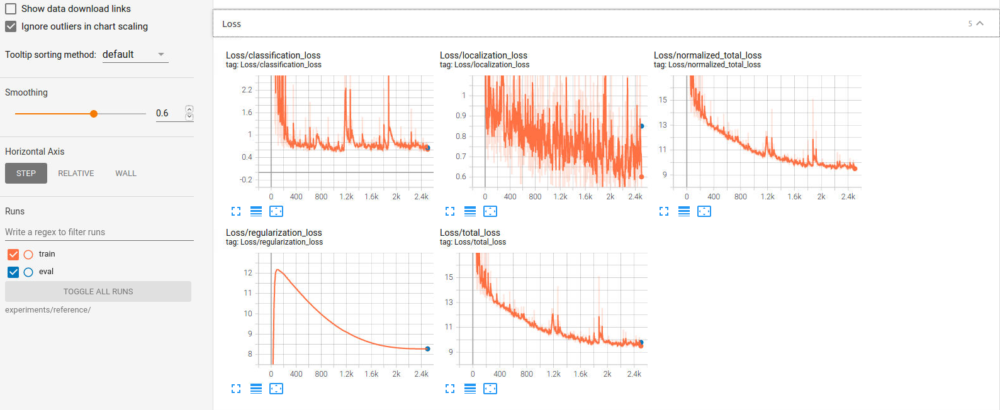

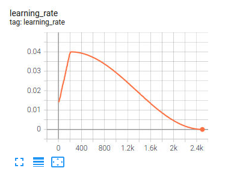

### Augmentation

Explored the Object Detection API and applied many different augmentations to prevent overfitting

Used various augmentation strategies:
1. random_horizontal_flip
2. random_crop_image
3. random_adjust_brightness
4. random_adjust_contrast
5. random_adjust_hue
6. random_adjust_saturation
7. random_distort_color

### Experiment

Rate decay: Cosine. Changed warmup learning rate to 5e-4, warmup steps to 200 and total steps to 2500 to get the desired learning rate function.

Stopped training at 2500 steps.

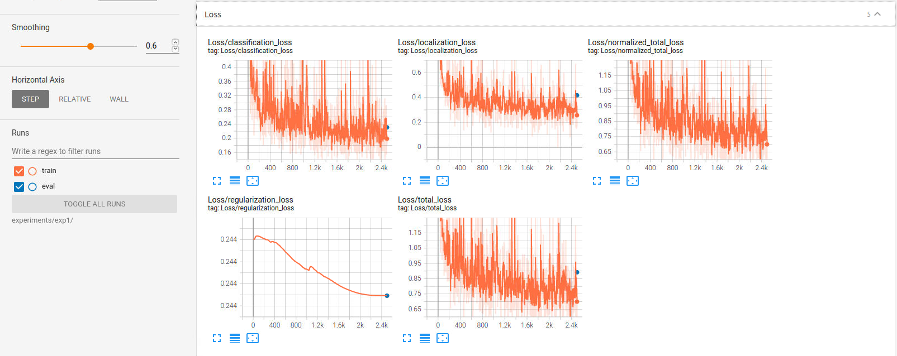

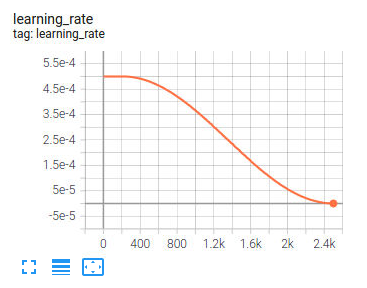


### Creating an animation

#### Export the trained model

Modify the arguments of the following function to adjust it to your models:

```
python experiments/exporter_main_v2.py --input_type image_tensor --pipeline_config_path experiments/reference/pipeline_new.config --trained_checkpoint_dir experiments/reference/ --output_directory experiments/reference/exported/
```

This should create a new folder `experiments/reference/exported/saved_model`. You can read more about the Tensorflow SavedModel format [here](https://www.tensorflow.org/guide/saved_model).

Finally, you can create a video of your model's inferences for any tf record file. To do so, run the following command (modify it to your files):
```
python inference_video.py --labelmap_path label_map.pbtxt --model_path experiments/reference/exported/saved_model --tf_record_path data/waymo/test/segment-12200383401366682847_2552_140_2572_140_with_camera_labels.tfrecord --config_path experiments/reference/pipeline_new.config --output_path animation.gif
```

## Test results


## Future Work
More time can be spent on find the right hyperparameters. Due to very limited compute resources, this could not be done.
